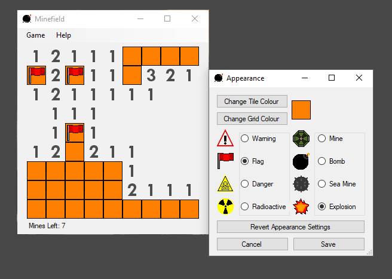

# Minefield
An adaptation of the classic game Minesweeper made in Visual Studio using C#

**Features:**
* Ability to change the game's colour scheme
* A variety of different icon styles to choose from
* Variable grid size and mine count
* Win and loss statistics
* Right click to add a flag over a tile
* Clicking a flagged tile does not activate a mine

**Platforms**

Windows 7 or higher

**Install**

Download the repository and run setup.exe

**Description**

Minefield is a game consisting in a set of mines randomly placed in a grid, it is your job to find all tiles within the grid that do not have a mine underneath them.

In order to find out which tiles have mines underneath them, when you click on a tile that is not over a mine it will reveal the number of mines in the surrounding area, if you believe you know the location of a mine you can right click on a tile to mark it as dangerous, and to prevent you from accidentally clicking on it later in the game. You must use your intuition and the numbers you are given to find all of the empty tiles. When you click on a mine, you lose the game, however if you reveal all of the empty tiles you win.

Good luck!